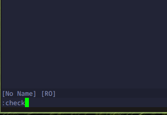
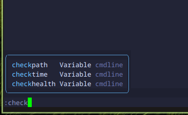

# Cmdline Source
Cmdline source adalah source yang berisi autocompletion untuk  perintah-perintah yang tersedia pada command line neovim.

## Instalasi 

```lua
return {
	"hrsh7th/cmp-cmdline"
}
```

## Intergrasi dengan Autocompletion Engine
Agar source ini dapat tersedia dan digunakan pada fitur autocompletion kita harus mendaftarkannya source ini terlebih dahulu pada konfigurasi autocompletion engine.

```lua
opts = function()
    local cmp = require("cmp")
		cmp.setup.cmdline(":", {
			sources = {
				{ name = "cmdline" },
			},
			matching = { disallow_symbol_nonprefix_matching = false },
		})
end
```

disini kita hanya daftarkan pada konfigurasi untuk kondisi saat menjalankan command menggunakan `:` saja. Alasannya karna selain dikondisi tersebut kita tidak perlu fitur ini, selain itu akan cukup mengganggu juga jika didaftarkan untuk dikondisi lain.

## Result

### Before


### After
